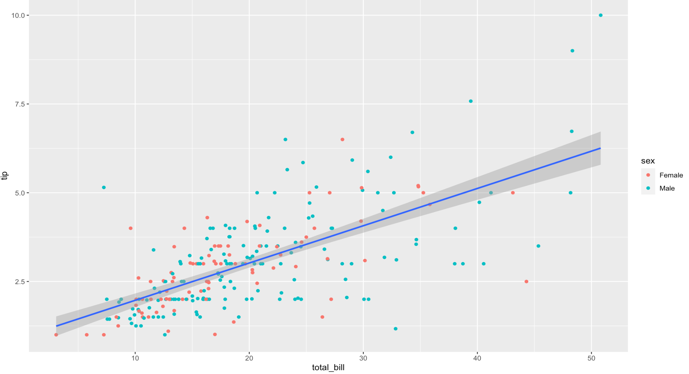
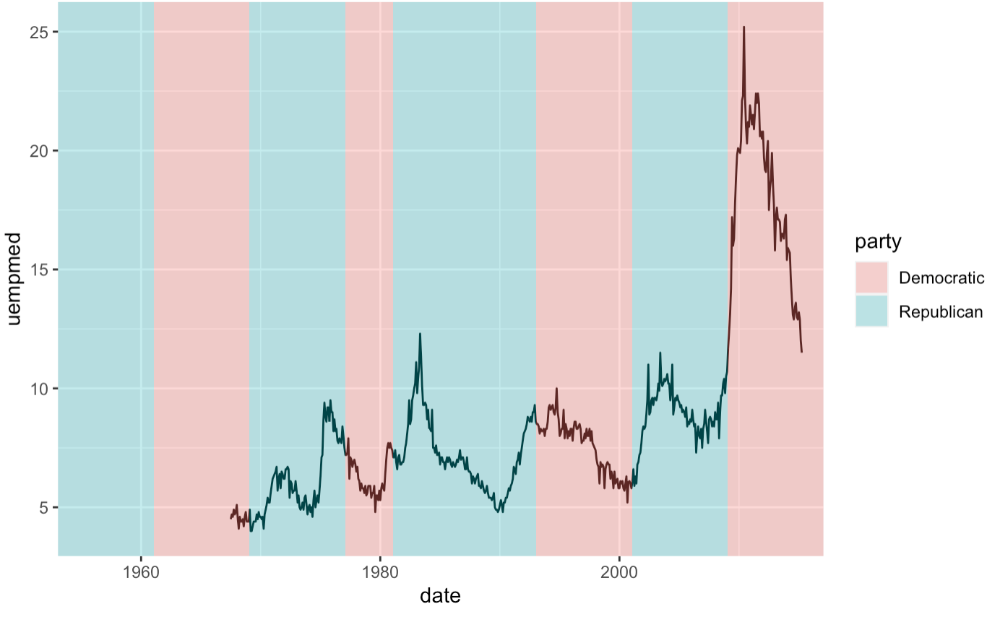
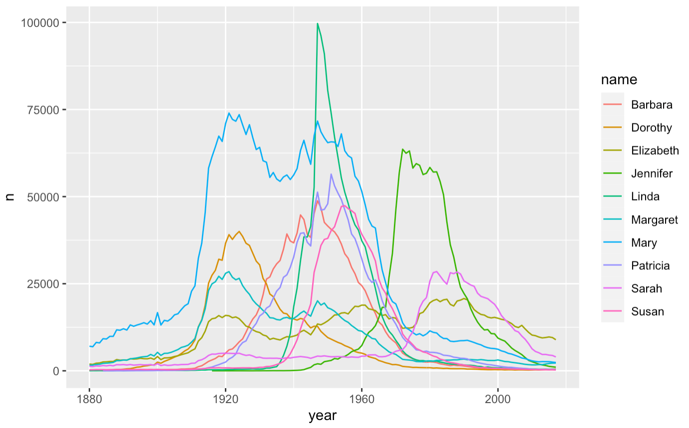
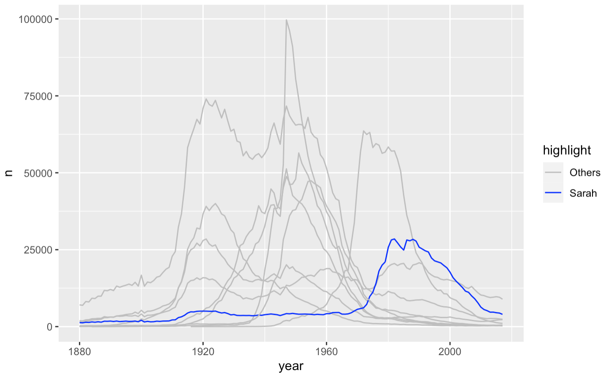

```{r setup}
library(tidyverse)
```

> A picture is worth thousand words.

One of the best parts of R is its plotting capabilities. Most model output has
an associated `plot` method which allows one to quickly visualize the results of
an analysis using a consistent interface.

R has three predominant graphics systems:

1.  Base R
2.  Lattice
3.  ggplot2

Base R is the oldest graphics system in R and is built in. The Lattice graphics
system is enabled by the package
[`lattice`](https://cran.r-project.org/web/packages/lattice/index.html) and is
one of the recommended packages that is installed by default. Finally, the
[`ggplot2`](https://ggplot2.tidyverse.org/) package is the most modern of the
graphics systems and is now a part of the
[`tidyverse`](https://www.tidyverse.org/), a consistent set o tools that allow
end-to-end analysis of data. In this lesson, we will focus our attention on
`ggplot2` as it is remarkably flexible in the kind of plots it can build.


# Grammar of Graphics

We have used `ggplot2` before when we were analyzing the `babynames` data. Just
to recap, let us recreate a column plot of the most popular names of all time by
sex.

```{r plot-most-popular-names}
library(babynames)
babynames %>%
  group_by(sex, name) %>% 
  summarize(n = sum(n)) %>% 
  top_n(10) %>% 
  mutate(name = fct_reorder(name, n)) %>% 
  ggplot(aes(x = n, y = name)) +
  geom_col() +
  facet_wrap(~ sex, scales = 'free_y') +
  scale_x_continuous(labels = scales::unit_format(scale = 1e-6, unit = 'M')) +
  labs(
    title = 'Most Popular Names of All Time',
    x = 'Number of Births',
    y = 'Name',
    caption = 'Source: SSA: Baby Names'
  )
```

The `ggplot2` package syntax might seem unnecessarily verbose when you are
creating simple plots. In fact, the package ships with a lighter `qplot`
function (it stands for "quick" plot) that pretty much works as a
drop-in-replacement for the `plot` function in base R. However, please DO NOT
get seduced by its simplicity in favor of the power of the more verbose
`ggplot()` syntax.


```{r plot-name-trend-richard}
babynames %>% 
  filter(name == 'Richard') %>% 
  qplot(x = year, y = n, color = sex, data = ., geom = 'line')
```


So if there is one advice I could give you about learning `ggplot2`, it would be
to stop reading examples using `qplot` because it gives you the false impression
that you have mastered the grammar, when in fact you have not. `qplot` provides
some nice syntactic sugar, but is not the real deal.


So, what is the **grammar of graphics**? Rather than describing the theory
behind the grammar, let me explain it by deconstructing the plot you see below.
It uses the `tips` dataset from the package `reshape2`.



__Some Questions to Explore__

1. How would you describe this plot to someone?
2. What are the various elements you see in this plot?
3. How would you go about creating this plot?

```{r}
data(tips, package = 'reshape2')
tips
```


I want to focus your attention on two sets of elements in this plot

__Aesthetics__

First, let us focus on the variables `tip`, `total_bill` and `sex`. You can see
from the plot that we have mapped `total_bill` to `x`, `tip` to `y` and the
color of the point to `sex`. These graphical properties `x`, `y` and `sex` that
encode the data on the plot are referred to as `aesthetics`. Some other
aesthetics to consider are `size`, `shape` etc.

__Geometries__

The second element to focus on are the visual elements you can see in the plot
itself. I see three distinct visual elements in this plot.

  - point
  - line
  - ribbon

These actual graphical elements displayed in a plot are referred to as
`geometries`. Some other `geometries` you might be familiar with are `area`,
`bar`, `text`.

Another very useful way of thinking about this plot is in terms of `layers`. You
can think of a `layer` as consisting of `data`, a `mapping` of `aesthetics`, a
`geometry` to visually display, and sometimes additional parameters to customize
the display.

> How many layers does this plot have?

There are three layers in this plot. A `point` layer, a `line` layer and a
`ribbon` layer. Let us start by defining the first layer, `point_layer`.
`ggplot2` allows you to translate the `layer` exactly as you see it in terms of
the constituent elements. The syntax being used might seem very verbose when
compared to `qplot`, but I recommend some patience, since the rewards you reap
by understanding the grammar are worth the trouble.

```{r layer1}
layer_point <- geom_point(
  mapping = aes(x = total_bill, y = tip, color = sex),
  data = tips
)
ggplot() + 
  layer_point
```

That was easy! Wasn't it? Let us move on to the second layer. It is a
regression line fitted through the points. We know that the `x` is still mapped
to `total_bill`, but we have to map the `y` to a fitted value of `tip` rather
than `tip`. How do we get the fitted value?

Well, we can use `lm` followed by `predict` to compute not only the fitted
values, but also a confidence interval around the fitted values which will come
in handy later. Note that we combine the `total_bill` column with the predicted
estimates so that we can keep the `x` and `y` values in sync.

```{r}
# Fit a linear regression model
linear_reg <- lm(tip ~ total_bill, data = tips)
# Collect the fitted values and the prediction confidence interval
tip_preds <- as.data.frame(predict(linear_reg, interval = 'confidence'))
tip_pred <- tip_preds$fit
lwr <- tip_preds$lwr
upr <- tip_preds$upr

tips_2 <- tips %>% 
  mutate(tip_pred = tip_pred) %>% 
  mutate(lwr = lwr) %>% 
  mutate(upr = upr)

tips_2
```

Now it is time to define our second layer, since we have the data required to do
so.

```{r layer2}
layer_line <- geom_line(
  mapping = aes(x = total_bill, y = tip_pred),
  data = tips_2,
  color = "darkred"
)
ggplot() + 
  layer_point + 
  layer_line
```

That was fun right! Now, let me see if you have been able to grasp the idea of
the grammar. How would you go about adding the ribbon layer that adds a
confidence interval around the line? What about if you were asked to add a
prediction interval?

__Exercise 1__

Let me give you a hint. You need to use a `ribbon` geometry, which requires two
values of `y` corresponding to the lower and upper limits of the interval. You
can type `?geom_ribbon` to see the names of these `aesthetics` so that you can
provide them correctly in the `mapping` argument.

__Solution 1__

```{r layer3}
layer_ribbon <- geom_ribbon(
  mapping = aes(x = total_bill, ymin = lwr, ymax = upr),
  data = tips_2,
  # we use alpha to control transparency of the ribbon
  alpha = 0.3
)
ggplot() + 
  layer_point + 
  layer_line + 
  layer_ribbon
```


While the approach we took to create this plot was very logical and followed the
grammar, it is still verbose, especially since such plots are very common in
statistical applications. So is there a way to make this simpler?

Fortunately, both the grammar of graphics and its implementation in `ggplot2`
are flexible enough to define `statistical` transformations on the data in a
layer. In `ggplot2`, there is `stat = smooth`, which accepts a smoothing method
as input, and automatically does the statistical transformations in the
background. So, we can define the combined line and ribbon layers as:

```{r layer4}
layer_smooth <- geom_line(
  mapping = aes(x = total_bill, y = tip),
  data = tips,
  stat = "smooth",
  method = "lm"
)
ggplot() + 
  layer_point + 
  layer_smooth
```

That was better wasn't it. But wait a minute, there is still a lot of repitition
in this code, and repetition is never good. The `x` and `y` aesthetics in
`mapping` and the `data` argument are common to both `layer_point` and
`layer_smooth`. How do we remove this duplication?

All you need to do is to move the `data` and `mapping` definitions to the
`ggplot` base layer and all other layers automatically inherit this information,
if not specified explicitly. Once again kudos to Hadley for thinking through
this.

```{r layer5}
ggplot(tips, aes(x = total_bill, y = tip)) +
  geom_point(aes(color = sex)) +
  geom_smooth(method = 'lm')
```

Question: What would happen if you moved the `color` aesthetic to the `ggplot`
layer? Reason it out before proceeding to running the code.


__Exercise 2__

You will replicate the following plot shown below. You will need to use the
datasets `economics` and `presidential` from `ggplot2`. Start by thinking
about the layers in the plot, the aesthetic mappings, and the geometries.



```{r}
economics
presidential
```

```{r econ-presidential}
# YOUR CODE -----
layer_line <- geom_line(
  data = economics,
  mapping = aes(x = date, y = uempmed)
)
layer_rect <- geom_rect(
  data = presidential,
  mapping = aes(xmin = start, xmax = end, ymin = 0, ymax = 30, fill = party),
  alpha = 0.3
)


ggplot() +
  layer_rect + 
  layer_line
```

## Faceting

When dealing with multivariate data, we often want to display plots for specific
subsets of data, laid out in a panel. These plots are often referred to as
small-multiple plots. They are very useful in practice since you only need to
take your user through one of the plots in the panel, and leave them to
interpret the others in terms of that.

`ggplot2` supports small-multiple plots using the idea of `facets`. Let us
revisit our scatterplot of `total_bill` vs `tip`. We can facet it by the
variable `day` using `facet_wrap`.

```{r facet-wrap}
ggplot() +
  layer_point +
  layer_smooth +
  facet_wrap(~ day)
```

Note how `ggplot2` automatically split the data into four subsets and even
fitted the regression lines by panel. The power of a grammar based approach
shines through best in such situations.

We can also facet across two variables using `facet_grid`

```{r facet-grid}
ggplot() +
  layer_point +
  layer_smooth +
  facet_grid(smoker ~ day)
```

__Geometries__

1. `geom_line`
2. `geom_col` / `geom_bar`
3. `geom_area`
4. `geom_histogram`
5. `geom_boxplot`


## Recreate Plots

__Exercise 4__

Plot trends for the top 10 female namess



__Solution 4__

```{r}
library(babynames)
top_10_names <- babynames %>% 
  filter(sex == 'F') %>% 
  group_by(name) %>% 
  summarize(n = sum(n)) %>% 
  top_n(10) %>% 
  pull(name)

babynames %>% 
  filter(sex == 'F') %>% 
  filter(name %in% top_10_names) %>% 
  ggplot(aes(x = year, y = n, color = name)) +
  geom_line()
```


__Exercise 5__

Plot trends for the name "Sarah" along with trends for other names in the
top 10, faded in gray.



```{r}
babynames %>% 
  filter(sex == 'F') %>% 
  filter(name %in% top_10_names) %>% 
  mutate(highlight = ifelse(name == 'Sarah', 'Sarah', 'Others')) %>% 
  ggplot(aes(x = year, y = n, group = name, color = highlight)) +
  geom_line() +
  scale_color_manual(values = c('gray', 'blue'))
```

